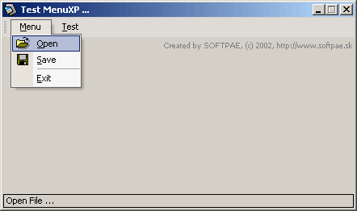



## XP Menu '2002 version 0\.12 \(alpha version\)

### Description

This is the next alpha version of my XP Menu system. Removed some bugs, new function to add pictures, now you don't need any external OCX (ImageList) for menu, load pictures from resources, add simple top menubar, recreated as control, ... Menu is show only in compiled exe, not in IDE, because it using hooking and resources, that not workin in debug mode (sorry, Microsoft)...

Anybody was deleted my original submission, so please vote for me!
 
### More Info
 

             |
---                |---
**Submitted On**   |2002-04-22 22:41:02
**By**             |[Anthonius](https://github.com/Planet-Source-Code/PSCIndex/blob/master/ByAuthor/anthonius.md)
**Level**          |Advanced
**User Rating**    |4.8 (72 globes from 15 users)
**Compatibility**  |VB 5\.0, VB 6\.0
**Category**       |[Custom Controls/ Forms/  Menus](https://github.com/Planet-Source-Code/PSCIndex/blob/master/ByCategory/custom-controls-forms-menus__1-4.md)
**World**          |[Visual Basic](https://github.com/Planet-Source-Code/PSCIndex/blob/master/ByWorld/visual-basic.md)
**Archive File**   |[XP\_Menu\_'2762294262002\.zip](https://github.com/Planet-Source-Code/anthonius-xp-menu-2002-version-0-12-alpha-version__1-34143/archive/master.zip)

